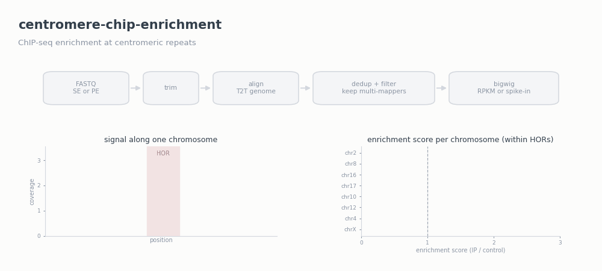

# centromere-chip-enrichment

ChIP-seq analysis pipeline for centromeric and repetitive regions: from raw
FASTQs to per-chromosome enrichment scores at alpha-satellite higher-order
repeats (HORs), human satellites, and chromosome arms.

Standard ChIP-seq workflows filter on mapping quality, which deletes the
multi-mapping reads that carry all the signal at centromeres. This pipeline
keeps them, aligns to a T2T-class genome, normalises correctly with or without
an exogenous spike-in, and quantifies enrichment per chromosome as
base-weighted signal ratios, plotted as lollipop charts.



Our own analyses were run on T2T genomes: T2T-CHM13v2.0 and a T2T RPE1
genome. The pipeline itself is genome agnostic and works with any
bowtie2-indexed genome and matching region annotations, including other
genome versions and other species, and with any ChIP target.

## What is included

| Tool | Scope | Job |
|---|---|---|
| `bin/chip_repeat_pipeline.sh` | per sample | lane merge, optional downsample, trim, align, dedup, filter, coverage track |
| `bin/spikein_scale_bigwigs.sh` | per experiment | spike-in scale factors and spike-scaled bigwigs |
| `bin/hor_enrichment.py` | per experiment | per-chromosome enrichment at HOR/HSat/arms, TSV and lollipop plots |

Two presets: `-P pol2` (single-end, no spike-in, RPKM tracks) and `-P rad21`
(paired-end, spike-in chromatin, spike-scaled tracks). Every parameter can be
overridden, see the docs.

## Requirements

Bioconda covers everything:

```bash
conda env create -f environment.yml
conda activate cenchip
```

Tools: `trimmomatic`, `bowtie2`, `samtools`, `deeptools` (brings `pyBigWig`),
`seqtk`, python with `matplotlib`, optional `fastqc`.

Reference files: a bowtie2 index of a T2T-class genome (for human,
T2T-CHM13v2.0 or a T2T RPE1 genome; older assemblies have no centromeres to
map to; any bowtie2-indexed genome works), a
`chrom.sizes` file, region BEDs in the same coordinates (HOR, optionally
HSat2/HSat3, e.g. from the CHM13 censat annotation), an adaptor fasta for
Trimmomatic, and a bowtie2 index of the spike genome for spike-in runs.

## Quick start

Single-end, no spike-in:

```bash
bin/chip_repeat_pipeline.sh -P pol2 -n POL2_ICRF -a all_adaptors.fa \
  -g /data/index/chm13v2.0 \
  -1 ICRF_L001_R1.fq.gz,ICRF_L002_R1.fq.gz \
  -p 8 -o results
```

Paired-end with spike-in, then the group scaling step:

```bash
bin/chip_repeat_pipeline.sh -P rad21 -n IP_rep1 -a all_adaptors.fa \
  -g /data/index/chm13v2.0 -s /data/index/GRCm39 \
  -1 sample_R1.fq.gz -2 sample_R2.fq.gz \
  -p 8 -o results

bin/spikein_scale_bigwigs.sh -o results -p 8
```

Enrichment. `pairs.tsv` is a small file you write yourself, one comparison
per line, three tab-separated columns: a label, the IP bigwig, the control
bigwig:

```bash
bin/hor_enrichment.py --pairs pairs.tsv \
  --regions HOR=hor.sorted.bed --regions HSat2=hsat2.bed --regions HSat3=hsat3.bed \
  --chrom-sizes chm13v2.0.chrom.sizes --out results/_enrichment
```

This gives one lollipop panel per pair for each region set plus an automatic
outside-HOR (chromosome arm) control, and `enrichment.tsv` with every number.

## Documentation

- `docs/chip_repeat.md`: design decisions and two worked examples.
- `docs/how_to_run.md`: step-by-step guide, every option explained, sanity
  checks, common problems.

## The three rules the pipeline enforces

1. No MAPQ filtering (`-F 2308` only), because centromeric reads are
   multi-mappers. Interpret signal at region level, not base-pair level.
2. One normalisation, never two: RPKM without spike-in, or a spike scale
   factor with `--normalizeUsing None`. Never a spike factor on top of RPKM,
   deepTools multiplies them and depth gets corrected twice.
3. Enrichment scores are base-weighted signal sums, IP over control, within
   identical intervals, so region length cancels and chromosomes are
   comparable.

## Citation

If you use this pipeline, please cite this repository
(github.com/santoshbiowarrior333/centromere-chip-enrichment) and the
associated manuscript (in preparation). See `CITATION.cff`.

## License

MIT. See `LICENSE`.
